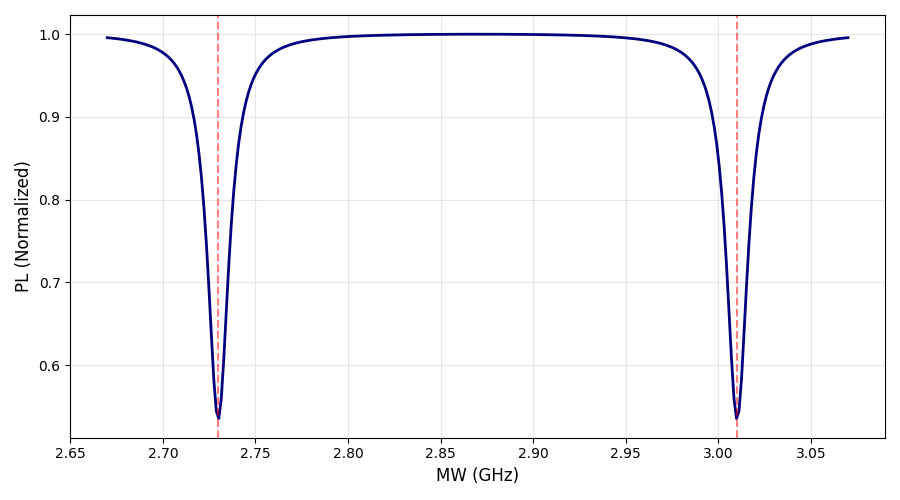
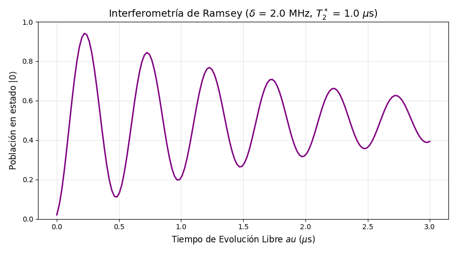

# NV Center Simulations

Quantum open-system simulations of **Nitrogen-Vacancy (NV) centres in diamond**, built with [QuTiP](https://qutip.org/). The scripts reproduce key spectroscopic observables (photoluminescence, Ramsey fringes, GSLAC/ESLAC features) as a function of applied magnetic and electric fields, providing an accessible numerical testbed for NV-based sensing and quantum-optics studies.

---

## Repository structure

```
NV Centers Code/
├── CW-ODMR.py                           # Continuous-wave ODMR spectrum simulation
├── Ramsey.py                            # Pulsed Ramsey interferometry simulation
├── GSLAC ESLAC con E.py                 # GSLAC / ESLAC features under a static electric field
├── GSLAC ESLAC con E 4 orientaciones NV.py  # Same, averaged over all 4 NV orientations in diamond
├── AC-Efield.py                         # Dynamic response to an oscillating AC electric field
├── NV_E_G_SLAC_explanation.pdf          # Supplementary notes on GSLAC / ESLAC physics
└── Figures/                             # Pre-generated output figures (PNG)
    ├── CW-ODMR.png
    ├── Ramsey.png
    ├── ESLAC-GSLAC con E.png
    └── Fixed bias B AC E.png
```

---

## Physics background

NV centres are point defects in diamond with a spin-1 ground state (GS) and excited state (ES). This repository models the full **7-level system** (|g₀⟩, |g₋⟩, |g₊⟩, |e₀⟩, |e₋⟩, |e₊⟩, |s⟩) under continuous laser driving and incoherent decay (Lindblad formalism). The key parameters shared across all scripts are:

| Symbol | Value | Meaning |
|---|---|---|
| D_g | 2.87 GHz | Zero-field splitting, ground state |
| D_e | 1.4 GHz | Zero-field splitting, excited state |
| γ_e | 2.8024 MHz / Gauss | Electron gyromagnetic ratio |
| d_∥^GS | 0.35 Hz/(V/cm) | Axial Stark coefficient, GS |
| d_∥^ES | 20 kHz/(V/cm) | Axial Stark coefficient, ES |

---

## Scripts

### `CW-ODMR.py` — Continuous-Wave ODMR

Sweeps the microwave frequency around D_g and solves the steady-state density matrix at each point to obtain the photoluminescence (PL) spectrum. Produces a characteristic double-dip whose splitting reveals the applied DC magnetic field B_z.

**Key parameters to tune:**
- `Bz` — static field to sense (Gauss)
- `Omega_mw` — microwave Rabi frequency (Hz)

**Output:** PL vs. MW frequency plot with vertical markers at the theoretical resonance positions.

---

### `Ramsey.py` — Ramsey Interferometry

Simulates the pulse sequence π/2 – τ – π/2 on the GS spin-1 subspace. The free-evolution time τ is swept up to 3 µs, and pure dephasing (T₂\*) is modelled via a Lindblad collapse operator on S_z.

**Key parameters to tune:**
- `Bz` — field to measure (Gauss)
- `delta` — MW detuning (Hz), sets the Ramsey fringe frequency
- `T2_star` — transverse coherence time (s)

**Output:** Population in |m_s = 0⟩ as a function of free-evolution time τ, showing oscillating fringes that decay on the T₂\* timescale.

---

### `GSLAC ESLAC con E.py` — Static E-field shift of GSLAC and ESLAC

Sweeps the magnetic field magnitude B from 450 to 1150 Gauss at three values of axial electric field (5, 10, 30 kV/cm) for a **single NV orientation** (with a small fixed misalignment α = 0.1 × π/2 rad). Uses the longitudinal Stark effect to track the differential shift of the ESLAC (~502 G) relative to the nearly-immobile GSLAC (~1024 G).

**Key parameters to tune:**
- `alpha` — B-field misalignment angle (rad)
- `Ez_values` — list of electric fields to simulate (V/cm)
- `B_vals` — magnetic field sweep range (Gauss)

**Output:** Normalised PL vs. B for each E-field value.

---

### `GSLAC ESLAC con E 4 orientaciones NV.py` — 4-orientation NV ensemble

Extends the previous simulation to a **polycrystalline / multi-orientation ensemble** by averaging the PL over all four inequivalent ⟨111⟩ NV axes in diamond. The external magnetic field is applied nearly along [111] (n1), and the electric field along [001].

**Key parameters to tune:**
- `desalineacion` — misalignment of B from the n1 axis (rad)
- `Ez_lab_values` — macroscopic electric field amplitudes (V/cm)
- `B_vals` — B sweep range (Gauss)

**Output:** Stacked normalised PL curves for each E-field, showing how the four families of ESLAC features spread and shift.

---

### `AC-Efield.py` — Dynamic response to an oscillating electric field

Fixes the bias field at B ≈ 502 G (ESLAC region, maximum slope) and uses `mesolve` to integrate the time-dependent Lindblad equation with a sinusoidal electric field E(t) = E₀ sin(ω t) at f = 1 MHz. Compares the PL waveform for a **linear** (E₀ = 200 V/cm) and a **saturated / distorted** regime (E₀ = 1500 V/cm).

**Key parameters to tune:**
- `B_bias` — DC magnetic bias field (Gauss)
- `alpha` — small misalignment angle for the B field (rad)
- `f_osc` — AC electric field frequency (Hz)
- `E0` argument inside `simular_senal()` calls

**Output:** Two-panel "virtual oscilloscope" plot showing the NV PL signal vs. time alongside the phase reference of the driving field.

---

## Requirements

```
python >= 3.9
numpy
matplotlib
qutip >= 4.7
```

Install with:

```bash
pip install numpy matplotlib qutip
```

> **Note:** QuTiP 5 introduced some API changes. All scripts have been tested against **QuTiP 4.7.x**. If you use QuTiP 5, verify that `steadystate`, `mesolve`, and `Options` are imported from the correct sub-modules.

---

## Running the simulations

Each script is self-contained. Run any of them directly:

```bash
python "CW-ODMR.py"
python "Ramsey.py"
python "GSLAC ESLAC con E.py"
python "GSLAC ESLAC con E 4 orientaciones NV.py"
python "AC-Efield.py"
```

The ensemble and AC-field scripts are the most computationally demanding (outer B-sweep × inner orientations / time steps). Expect runtimes of **several minutes** on a standard laptop.

---

## Output gallery

| Script | Figure |
|---|---|
| `CW-ODMR.py` |  |
| `Ramsey.py` |  |
| `GSLAC ESLAC con E.py` |  |
| `AC-Efield.py` |  |

---

## References

- [Doherty et al., *Physics Reports* 528, 1 (2013)](https://doi.org/10.1016/j.physrep.2013.02.001) — Comprehensive review of NV centre physics.
- [Johansson et al., *Comput. Phys. Commun.* 183, 1760 (2012)](https://doi.org/10.1016/j.cpc.2012.02.021) — QuTiP: Quantum Toolbox in Python.
- [`NV_E_G_SLAC_explanation.pdf`](NV_E_G_SLAC_explanation.pdf) — Supplementary derivations for the GSLAC/ESLAC regime included in this repo.

---

## License

This code was developed as part of an undergraduate Physics thesis (TFG). Feel free to use and adapt it for educational or research purposes.
